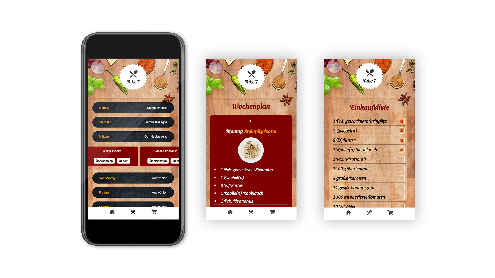

## Take 7 Meal Planner

## Motivation

This App lets you plan what you want to eat in the next seven days, saves a meal for each day, shows the recipe for each cooking experience and conveniently generates a shopping list.

## Screenshots

## Tech Stack

-   React
-   React Router
-   React Hooks
-   Styled Components
-   PropTypes
-   Styleguidist
-   React Testing Library
-   JEST
-   Cypress

## How to use?

`$ npm install`

Installs all packages.

`$ npm test`

Verify that the project runs without errors.

`$npm run build`

Builds the app for production to the `build` folder.\
It correctly bundles React in production mode and optimizes the build for the best performance.

The build is minified and the filenames include the hashes. The app is ready to be deployed!
